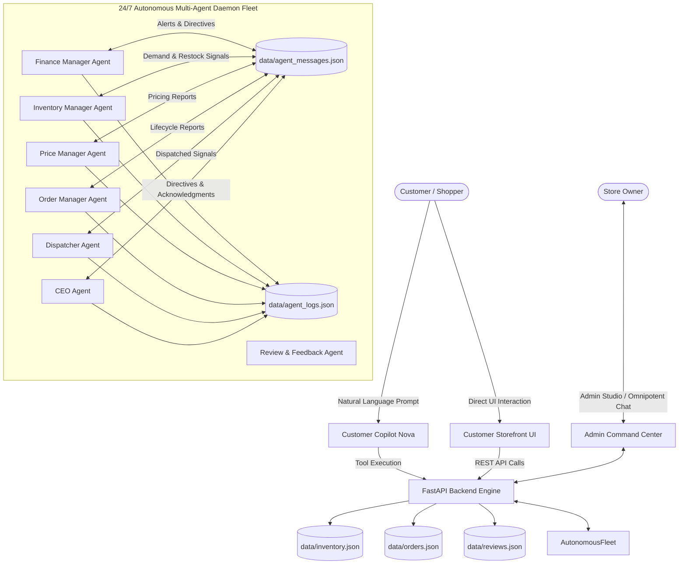
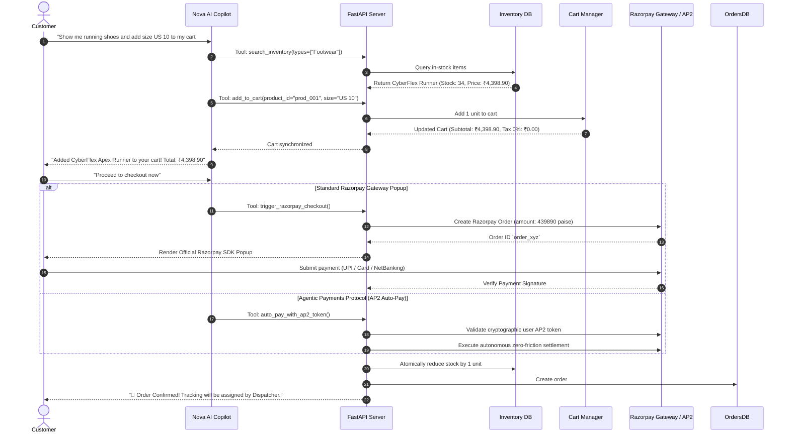
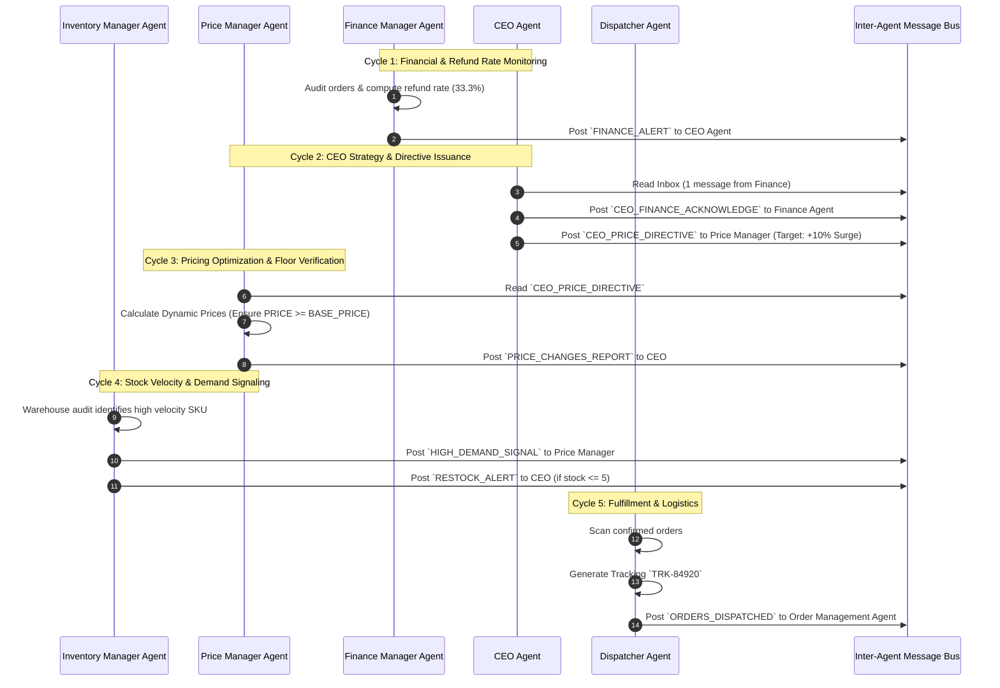
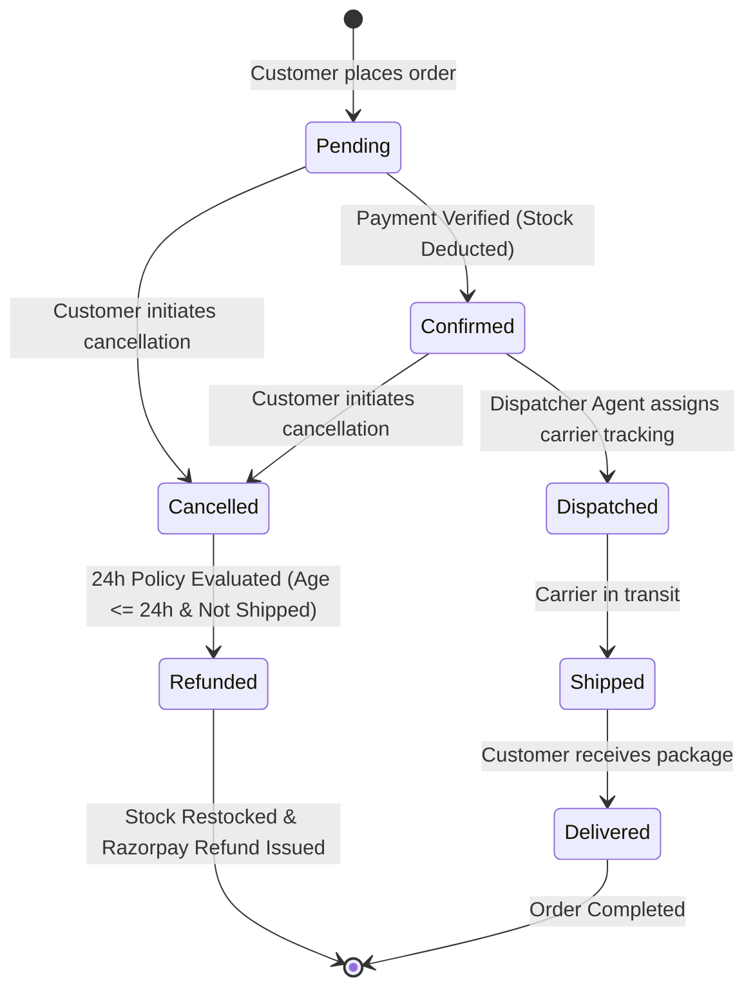
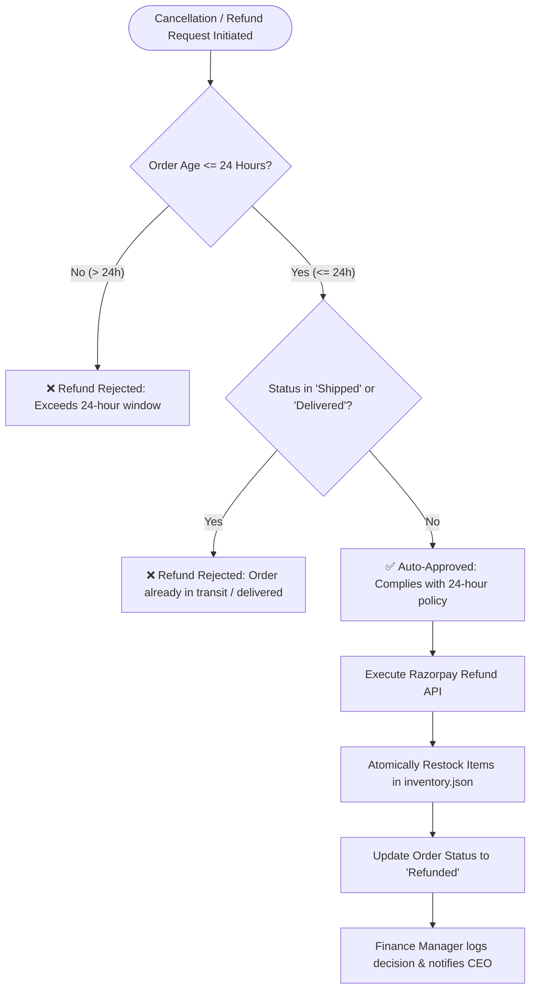
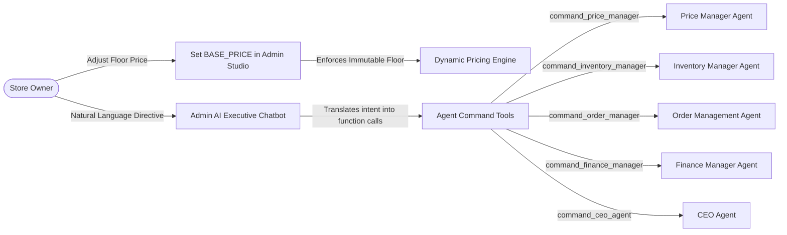

# 🔄 AI Growth Commerce - Agentic Store
## Complete Operational & Multi-Agent Workflow Specification

---

## 1. 🌐 Overall System Ecosystem Workflow

---

## 2. 🛍️ Customer Shopping & Payment Workflow

---

## 3. 🤖 Closed-Loop Multi-Agent Collaboration Workflow

---

## 4. 📦 Order Lifecycle State Machine

---

## 5. 💰 Strict 24-Hour Refund Decision Tree

---

## 6. 👑 Store Owner Command & Control Workflow

